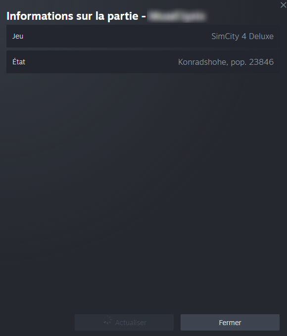

# SC4SteamRichPresence

A SimCity 4 plugin that pushes the current city, region and population to Steam Rich Presence.

## What you see

When you load a city, your Steam status updates with something like `Tutorland, Pessac (pop. 22618)`. It refreshes every in-game month. When you leave the city, the status clears.

Friends can see this in Steam's "View Game Info" dialog (right-click your name in the friends list).



## Install

Drop both files in your SimCity 4 `Plugins/` folder:

- `SC4SteamRichPresence.dll`
- `steam_api.dll`

Launch the game through Steam as usual. No config needed.

If your plugins live in a UserDir (Dropbox coop, separate folder, etc.), put both DLLs there together. The plugin resolves `steam_api.dll` from its own directory first.

## Debug dialog

Press Ctrl+X in game to open SC4's cheat console, type `sc4srp_debug` and hit Enter. A native SC4 dialog opens with the current city, region, population, your Steam name and SteamID64.

By default the plugin runs silent. To enable logging, set `SC4SRP_DEBUG=1` in your Steam launch options:

```
SC4SRP_DEBUG=1 %command%
```

Logs are written to `C:\sc4srp.log` (inside the Wine prefix when running under Proton).

## Build

Linux cross-compile to 32-bit Windows:

```bash
sudo pacman -S mingw-w64-gcc cmake ninja git    # CachyOS / Arch
git clone --recurse-submodules https://github.com/parigi-n/simcity4-steam-rich-presence
cd simcity4-steam-rich-presence
cmake -S . -B build -G Ninja \
    -DCMAKE_TOOLCHAIN_FILE=toolchain-mingw32.cmake \
    -DCMAKE_BUILD_TYPE=Release
cmake --build build
```

If you cloned without `--recurse-submodules`, run `git submodule update --init` to pull the Steamworks SDK before building.

The output DLL lands in `build/SC4SteamRichPresence.dll`.

### External dependencies

- `external/gzcom-dll/` is a vendored copy of [nsgomez/gzcom-dll](https://github.com/nsgomez/gzcom-dll) (LGPL 2.1), the SC4 plugin SDK. Two local edits are baked into it: a MinGW vtable layout fix on `cIGZString.h` (see Quirks) and a missing `<cstring>` include in `cRZMessage2Standard.cpp`. Pinned to upstream commit `ac65d6d`. The reason it is vendored instead of being a submodule is that the local edits would have to be reapplied on every fresh checkout otherwise.
- `external/steamworks_sdk/` is a git submodule pointing at the [rlabrecque/SteamworksSDK](https://github.com/rlabrecque/SteamworksSDK) mirror. Used at build time for the headers and at runtime for `steam_api.dll` (which gets shipped alongside the plugin DLL).

## Quirks

**SC4's AppID belongs to EA, which puts a hard limit on Steam Rich Presence.** The status text gets pushed and Steam stores it server-side, but it only shows up in the "View Game Info" dialog, not the main friend list line. To get rich text in the main friend list, the AppID owner has to register localization tokens in the Steam Partner backend. EA never did that for SC4 and probably never will. There is no client-side workaround.

**MinGW ABI patch on `cIGZString.h`.** SC4 was built with MSVC. MSVC and MinGW order overloaded virtual methods differently in vtables, which causes hard crashes when SC4 calls back into our `cIGZString`-derived buffers (like the one passed to `GetCityName`). The fix is a `#if __MINGW32__` block in `external/gzcom-dll/gzcom-dll/include/cIGZString.h` that reverses overload groups so the MinGW vtable matches MSVC's. Only `cIGZString.h` is patched. If you start touching other gzcom-dll interfaces with overloaded virtuals, you may need to patch them the same way. A cleaner long term path is to switch the toolchain to clang targeting MSVC ABI (`--target=i686-pc-windows-msvc`) plus [xwin](https://github.com/Jake-Shadle/xwin) for the Windows SDK, then drop the patches entirely.

**Tested with Proton.** Should work fine on Windows too, but only tested on Linux via Steam Proton so far.
